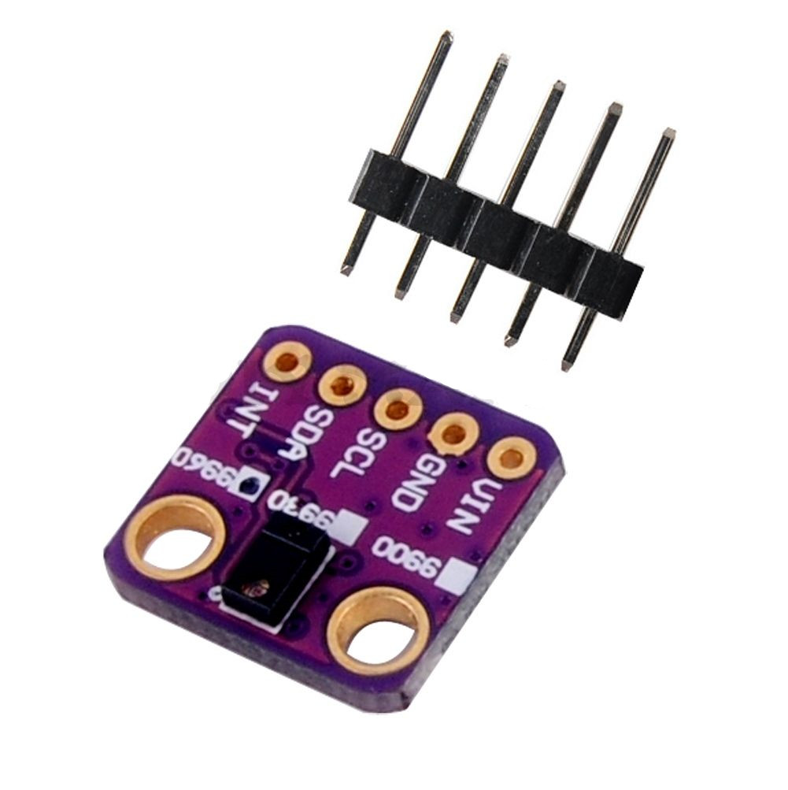

APDS-996 library found on http://www.stm32duino.com/viewtopic.php?f=3&t=2928 post by stevestrong
Only works in polling mode (not used interrupt mode)

| Arduino Pin | APDS-9960 Board | Function  |
+-------------+-----------------+-----------+
|     3.3V    |      VIN        | Power     |
|     GND     |      GND        | Ground    |
|     A4      |      SDA        | I2C Data  |
|     A5      |      SCL        | I2C Clock |
|     2       |      INT        | Interrupt |
+-------------+-----------------+-----------+
History:
* Added README.md file
* Adjust some params LED_BOOST and DEFAULT_GGAIN in gesture mode who working better with my GY-9960LLC/APDS9960 purple module
* Removed TwoWire alternative usage

